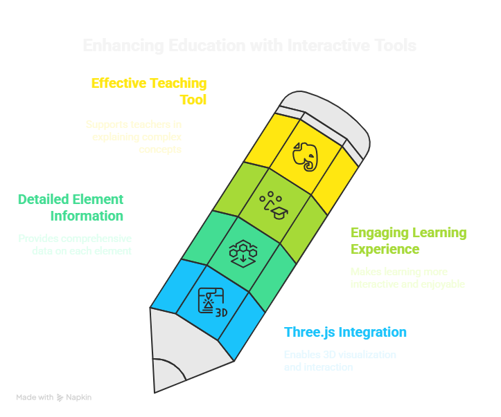

# Interactive Periodic Table Leveraging Three.js

The Interactive Periodic Table is designed to provide an immersive learning experience for
students. By incorporating Three.js, the project allows users to **Transform table's Structure in desired forms** and hover over
elements to receive detailed information, making the learning process more engaging and
effective. 

## Key Innovative Features

-  **Interactive Hover Information:** Users can hover over elements to access detailed
information, enhancing engagement and understanding.
- **Inter-Changeable Structure:** The project is designed to visualize Periodic Table in more than 1 formats,
 To memorise it better.

-  **Filtering Options:** The ability to filter elements by properties (e.g., metals, non-metals)
allows for targeted learning and exploration.
- **3D Visualization:** The use of Three.js provides a dynamic 3D representation of the
periodic table, making learning more visually appealing.

## Technical Architecture

- **Resolution:** High-resolution graphics to ensure clarity and detail.
- **3D Rendering:** Utilize three.js technologies for rendering the 3D tiles.
- **Responsive Design:** The visualization should be adaptable to various screen sizes, ensuring accessibility on both desktop and mobile devices.
- **Integration:** The visualization will be designed for easy integration into web applications, for seamless user experience.

### Hover Effects

When users hover over a tile, the following detailed information will be displayed in a tooltip:

- **Atomic Number:** The number of protons in the nucleus of the atom.
- **Symbol:** The one or two-letter abbreviation of the element.
- **Atomic Mass:** The weighted average mass of the element's isotopes.
- **Electron Configuration:** The distribution of electrons in the atom's orbitals.

## Conclusion

This interactive 3D visualization of the periodic table aims to provide an engaging and informative experience for users. By incorporating color-coded tiles, hover effects, and detailed information, the tool will serve as an educational resource that enhances the understanding of chemical elements and their properties. The design will ensure clarity and usability, making it suitable for a wide range of audiences, from students to professionals in the field of chemistry.